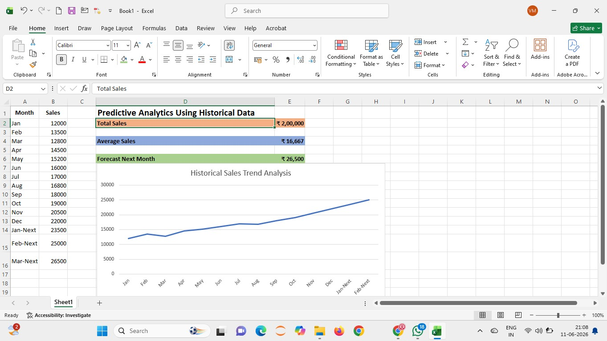

# 📈 Predictive Sales Analytics Using Historical Data

## 📌 Project Overview

This project is an **Excel-based Predictive Sales Analytics Dashboard** created to analyze historical sales data and estimate future sales performance.

The dashboard uses historical monthly sales data to identify sales trends, calculate key performance metrics, and forecast upcoming sales values.

---

## 🛠️ Tool Used

- Microsoft Excel

---

## 📊 Dashboard Features

- Total Sales
- Average Sales
- Historical Sales Trend
- Future Sales Forecast
- Monthly Sales Analysis
- Sales Trend Visualization
- Data Analysis
- Forecasting using Historical Data

---

## 📸 Dashboard Preview

---

## 🎯 Objective

The objective of this project is to analyze historical sales data and use the observed sales trend to estimate future sales performance.

The dashboard provides a simple visual representation of historical sales and predicted future values to support data-driven decision making.

---

## 📈 Key Metrics

| Metric | Value |
|---|---:|
| Total Sales | ₹2,00,000 |
| Average Sales | ₹16,667 |
| Forecast Next Month | ₹26,500 |

---

## 🔍 Analysis Performed

### Historical Sales Analysis

Monthly sales data from January to December was analyzed to understand the overall sales trend.

### Trend Analysis

A line chart was created to visualize changes in sales over time.

### Sales Forecasting

Historical sales values were used to estimate upcoming sales values and identify potential future growth.

### Business Insight

The analysis indicates an overall increasing sales trend, suggesting potential growth in future periods.

---

## 💡 Skills Demonstrated

- Data Analysis
- Microsoft Excel
- Sales Analysis
- Predictive Analytics
- Data Visualization
- Trend Analysis
- Forecasting
- Excel Charts
- Business Insights
- Data Interpretation

---

## 🚀 Project Outcome

This project provided practical experience in analyzing historical business data and converting it into meaningful insights using Microsoft Excel.

It demonstrates the ability to:

- Analyze historical sales data
- Identify sales trends
- Calculate important business metrics
- Visualize data using charts
- Estimate future sales
- Communicate business insights effectively

---

## 👩‍💻 Author

**Isha Manivannan**

Computer Science and Engineering Student

---

⭐ This project demonstrates practical application of Excel for sales analysis, visualization, and predictive analytics.
