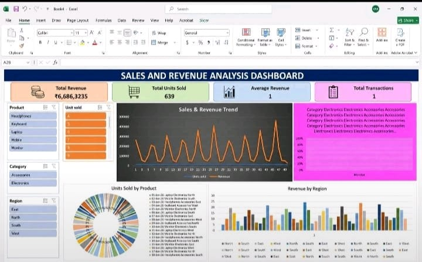

# Sales Analytics Dashboard

## 📊 Project Overview

This project is an Excel-based Sales Analytics Dashboard created to analyze
sales performance and generate meaningful business insights.

## 🛠️ Tool Used

- Microsoft Excel

## 📈 Dashboard Features

- Total Revenue
- Total Units Sold
- Average Revenue
- Total Transactions
- Product-wise analysis
- Category-wise analysis
- Region-wise analysis
- Sales trend visualization
- Interactive filters and slicers
- Data visualization

## 🎯 Objective

The objective of this project is to analyze sales data and present
important sales information through an interactive Excel dashboard.

## 📸 Dashboard Preview

## 💡 Skills Demonstrated

- Data Analysis
- Microsoft Excel
- Dashboard Creation
- Data Visualization
- Pivot Tables / Charts
- Interactive Slicers
- Business Insights

